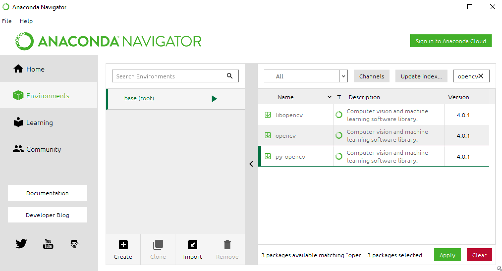

# GRO620 - Vision par ordinateur (S6R - APP6, E21)

Vous trouverez ici des fichiers Jupyter pour les activités procédurales et la résolution de la problématique.

Jupyter est un environnement qui permet de combiner de la documentation en
Markdown et des extraits de code en Python. Il est également possible d'ajouter
des éléments interactifs pour modifier le comportement du code. De plus, GitHub
fait un rendu (statique) des fichiers .ipynb, ce qui permet de visualiser
rapidement le contenu de ces fichiers.

Les images à utiliser pour la problématique se trouvent dans le dossier "images_prob/".

## Mise en route (Google Colab)

Pour suivre les activités procédurales et faire la problématique, on vous suggère d'utiliser [Google Colab](https://colab.research.google.com), qui permet d'héberger un environnement complet Jupyter en plus des dépendances nécessaires à l'APP (OpenCV et matplotlib). Il existe plusieurs façons pour stocker des calepins et les utiliser dans Google Colab, mais on vous suggère d'utiliser Google Drive. Pour cela, vous devez essentiellement :

 - Créer un dossier dans votre Google Drive pour l'APP
 - Copiez tous les fichiers de ce dépôt git dans le dossier Google Drive **en respectant la structure des sous-dossiers**.
 - Ouvrez un des calepins, par exemple "prob.ipynb".
 - Retirez les commentaires et modifiez les trois lignes permettant d'initialiser Google Drive pour le calepin (voir les commentaires dans la deuxième cellule pour plus de détails).
 - Lancez l'exécution (avec le menu "Exécution - Tout exécuter").
 - Google vous demandera d'activer l'accès à votre Google Drive pour ce calepin - suivez tout simplement les instructions.
 
À partir de maintenant, vous pourrez faire la totalité de votre travail depuis Google Colab, incluant la rédaction du rapport.

## Mise en route (Anaconda)

Si vous ne souhaitez pas utiliser Google Colab et Google Drive, vous pouvez aussi installer Jupyter sur votre propre ordinateur. Les fichiers fournis supposent que vous utiliserez Python 3 et la librairie OpenCV version 4. Pour vous assurez d'avoir les bonnes versions, on vous suggère fortement d'installer la distribution Anaconda (faites attention de bien sélectionner l'installation pour Python 3.7 et plus !) :

[Anaconda Individual Edition](https://www.anaconda.com/products/individual)

Ensuite, vous devez installer les paquets OpenCV nécessaires à l'APP. Pour cela, depuis Anaconda Navigator, cliquez sur Environments et tapez "opencv" dans le champ "Search Packages..." en haut à droite :

Cochez les paquets "libopencv", "opencv" et "opencv-py". Vérifiez qu'il vous propose bien la version 4. Vous n'avez ensuite qu'à appuyez "Apply" pour installer les paquets manquants.

**NOTE:** Il est possible, selon votre environnement, que les paquets n'aient pas exactement les mêmes noms. Si Anaconda ne vous propose que la version 3.4.2, vous devrez plutôt ouvrir la console "Anaconda Prompt" puis utiliser la commmande "pip install opencv-python".

## Problématique

Un fichier de départ (très) simple est fourni pour débuter le travail: ["prob.ipynb"](prob.ipynb). Vous pouvez lancer ce calepin pour vérifier que votre installation de Jupyter fonctionne bien.

## Activités procédurales 

Pour commencer, ouvrez tout simplement ["proc1_.ipynb"](proc_1.ipynb) depuis Jupyter. Toutes les instructions s'y trouve et vous pourrez éditer directement le fichier pour résoudre les activités.

